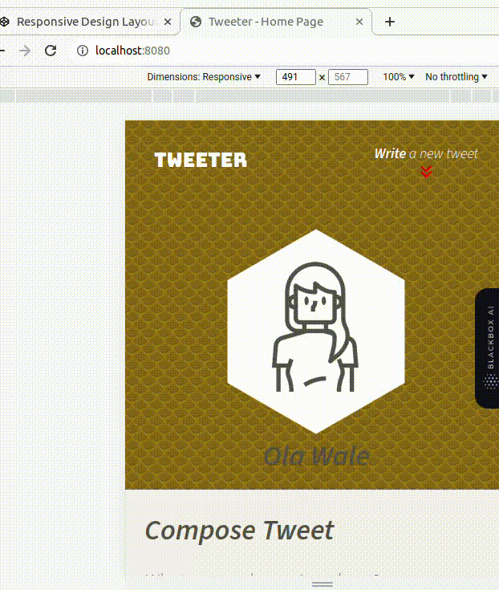
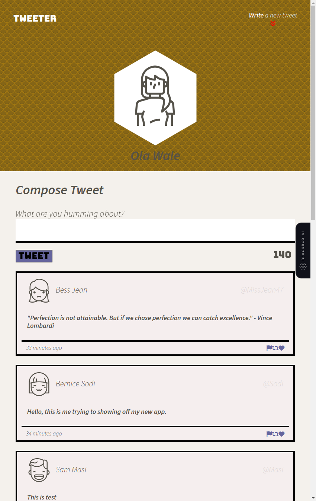

# Tweeter Project

Tweeter is a simple, single-page Twitter clone. The platform enables users to craft concise posts, limited to 140 characters, which are then seamlessly added to the central page.

These posts follow a chronological order, with the latest entries showcased at the page's forefront. The process is facilitated by Tweeter, which retrieves a streamlined collection of posts from a simplified 'server,' enabling users to contribute to this roster in real time.

This interaction occurs asynchronously, leveraging the jQuery library to initiate these requests and thereby providing an opportunity to acquaint ourselves with this technology

This [repository](https://github.com/lighthouse-labs/tweeter) is the starter code for the project: Students will fork and clone this repository, then build upon it to practice their HTML, CSS, JS, jQuery and AJAX front-end skills, and their Node, Express back-end skills.

## Final View of the Project

### 
Large Screen View

-
### 
Tweet Compose and Error Messages

-
### 
New Tweet Button

-
### 
Back to Top Button

  

### 
Small Screen View - Less than 1024 pixels

  

$~~~~~~~~~~~~~$
## Getting Started

1. [Create](https://docs.github.com/en/repositories/creating-and-managing-repositories/creating-a-repository-from-a-template) a new repository using this repository as a template.
2. Clone your repository onto your local device.
3. Install dependencies using the `npm install` command.
3. Start the web server using the `npm run local` command. The app will be served at <http://localhost:8080/>.
4. Go to <http://localhost:8080/> in your browser.

## Dependencies

- Express
- Body Parser
- Chance
- md5
- Node 5.10.x or above
